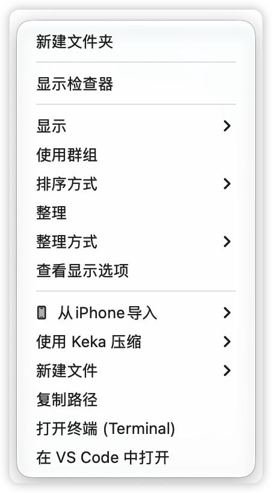
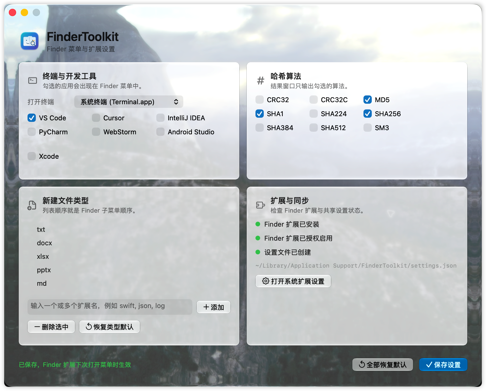
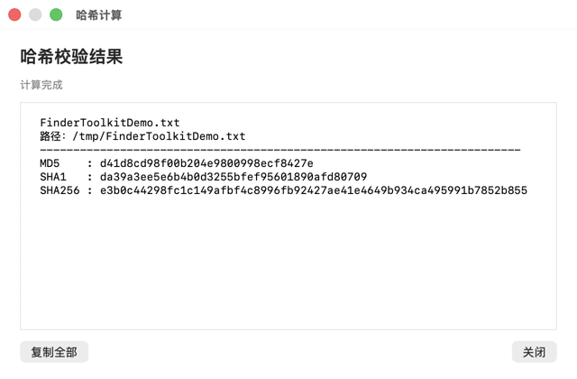

# FinderToolkit

FinderToolkit 是一个原生 macOS Finder 扩展，把常用的文件操作放到 Finder 右键菜单：复制路径、新建文件、计算哈希、打开终端，以及在 VS Code、Cursor、JetBrains IDE、Android Studio 或 Xcode 中打开当前目录。

它不联网、不上传文件，哈希计算在本机流式完成。设置文件只保存在本机的 `~/Library/Application Support/FinderToolkit/settings.json`。

## 下载

- [打开最新 Release 并下载 FinderToolkit](https://github.com/mora-na/FinderToolkit/releases/latest)

当前公开 DMG 是 Apple Silicon（`arm64`）构建，最低支持 macOS 13 Ventura。DMG 使用 ad-hoc 签名，未使用 Developer ID，也未经过 Apple notarization；首次打开时按下面的“首次启动”步骤操作。

## 功能

| Finder 菜单项 | 可用位置 | 作用 |
| --- | --- | --- |
| 复制路径 | 文件、文件夹、空白处、侧边栏、工具栏菜单 | 复制一个或多个路径；多选时每个路径占一行 |
| 新建文件 | 文件、文件夹、目录空白处 | 创建 `txt`、`docx`、`xlsx`、`pptx`、`md`、`csv` 等文件，自动避开重名 |
| 计算 hash | 一个或多个文件 | 流式计算 `CRC32`、`CRC32C`、`MD5`、`SHA1`、`SHA224`、`SHA256`、`SHA384`、`SHA512`、`SM3` |
| 打开终端 | 文件、文件夹、目录空白处 | 在目标目录打开 Terminal 或 iTerm2 |
| 在开发工具中打开 | 文件、文件夹、目录空白处 | 按设置页选择的工具动态显示菜单项 |

默认启用 `MD5`、`SHA1`、`SHA256` 和 VS Code。所有菜单、哈希算法、新建文件扩展名都可以在设置页调整。

## 使用截图

### Finder 菜单



在 Finder 文件夹空白处右键，即可新建文件、复制当前路径、打开终端，或使用已启用的开发工具打开当前目录。

### 设置页



在设置页选择终端、开发工具和哈希算法，编辑新建文件类型，确认 Finder 扩展状态，然后点击“保存设置”。

### 哈希结果



哈希结果窗口支持滚动查看和“复制全部”。大文件会显示开始前确认和计算进度，避免误操作。

## 安装与首次启动

1. 下载 DMG，双击打开后将 `FinderToolkit.app` 拖到 `Applications`。
2. 在“应用程序”中右键 FinderToolkit，选择“打开”。如果系统提示无法验证开发者，在“系统设置 -> 隐私与安全性”中确认“仍要打开”，再重新打开一次。
3. 打开“系统设置”，搜索“Finder 扩展”，进入 Finder 扩展列表并启用 `FinderToolkitExtension`。
4. 再次打开 FinderToolkit。设置窗口会自动出现；完成配置后点击“保存设置”。
5. 重启 Finder（按住 Option 键右键点击 Dock 中的 Finder，选择“重新启动”），在任意文件或目录空白处右键即可看到 FinderToolkit 菜单。

如果菜单没有出现，先确认 Finder 扩展仍处于启用状态，再退出并重新打开 Finder。设置页右下角的“扩展与同步”模块可以帮助确认扩展是否注册、授权以及设置文件是否已创建。

## 权限与隐私

- 主 App 和 Finder Sync Extension 使用 App Sandbox；文件操作只针对 Finder 当前选择或目录。
- 新建文件和打开终端在必要时通过 Apple Events 调用 Finder 或 Terminal，macOS 可能会显示自动化权限提示。
- 复制路径会尝试发送系统通知；不允许通知不会影响复制结果。
- 哈希计算使用 1 MB 缓冲区流式读取，不会一次性把大文件载入内存。
- 项目不包含用户文件、日志、证书指纹、Team ID、邮箱或个人绝对路径。设置页对用户主目录只显示 `~`。

## 从源码构建

环境要求：macOS 13 或更高版本、Xcode 15 或更高版本。打开 `FinderToolkit.xcodeproj` 后，分别为 `FinderToolkit` 和 `FinderToolkitExtension` 选择本机开发团队，再运行 `FinderToolkit` scheme。

也可以使用无签名构建检查源码：

```bash
xcodebuild \
  -project FinderToolkit.xcodeproj \
  -scheme FinderToolkit \
  -configuration Release \
  -derivedDataPath build/Release \
  CODE_SIGNING_ALLOWED=NO \
  build
```

## 生成发布 DMG

`Tools/package_release.sh` 会执行 Release 构建、去除本机调试路径、对 App 和 Extension 做 ad-hoc 签名、扫描用户名/主目录/邮箱模式、生成带版本号的 DMG 和固定名称的 `FinderToolkit-latest.dmg`，并运行 `codesign` 和 `hdiutil verify` 校验：

```bash
bash Tools/package_release.sh
```

输出文件为 `dist/FinderToolkit-<version>.dmg` 和 `dist/FinderToolkit-latest.dmg`。创建 GitHub Release 后，同时上传这两个资产，例如：

```bash
gh release upload v<version> \
  dist/FinderToolkit-<version>.dmg \
  dist/FinderToolkit-latest.dmg \
  --clobber
```

README 使用 GitHub 的 `releases/latest` 页面链接，因此后续正式 Release 会自动指向最新版本。脚本要求 Xcode 命令行工具和 `hdiutil`，不需要把证书或账号信息写入仓库。要制作可在 Gatekeeper 中直接通过的公开发行版，需要另外配置 Developer ID Application、Developer ID Installer（如有需要）和 Apple notarization 流程。

## 项目结构

```text
FinderToolkit/
├── FinderToolkit.xcodeproj/
├── FinderToolkit/                         # 主 App、设置页和 URL 入口
├── FinderToolkitExtension/                # Finder Sync Extension、菜单和哈希计算
├── Tools/generate_app_icon.swift           # 重新生成 AppIcon 资源
├── Tools/package_release.sh                # 构建、隐私扫描和 DMG 打包
└── docs/images/                            # README 使用截图
```

关键实现：

- `FinderSync.swift`：注册 Finder 右键菜单和菜单动作。
- `AppDelegate.swift`：处理 `findertoolkit://` 请求并展示哈希结果。
- `SettingsWindowController.swift`：设置页和扩展状态检查。
- `HashCalculator.swift`：使用流式读取计算多种哈希。
- `HashTypes.swift`：共享设置格式、规范化和本地存储。

## 发布校验

发布资产的 SHA-256 以对应 GitHub Release 中显示的 digest 为准；本地校验可运行：

```text
shasum -a 256 dist/FinderToolkit-<version>.dmg
```
